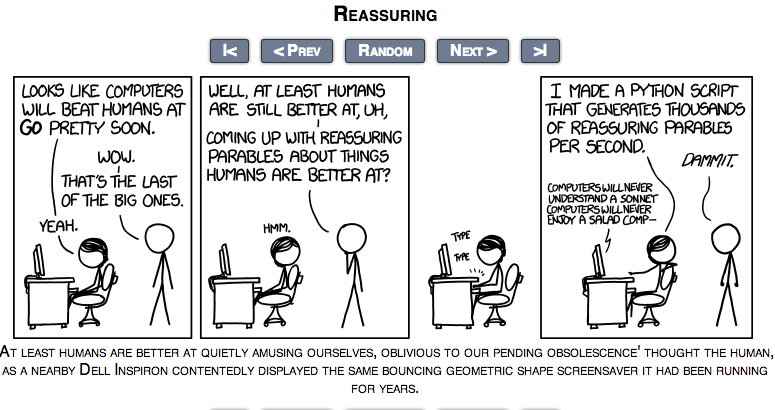

#No need to hover over xkcd comics

I was reading comics and got tired of having to move the mouse over the image to see the hidden message. So this extension prints it out underneath of the comic.

